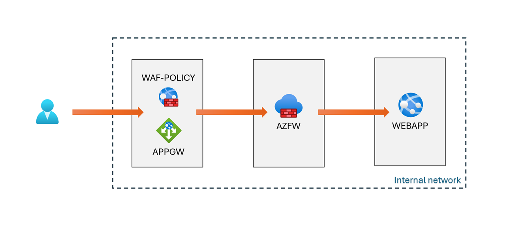
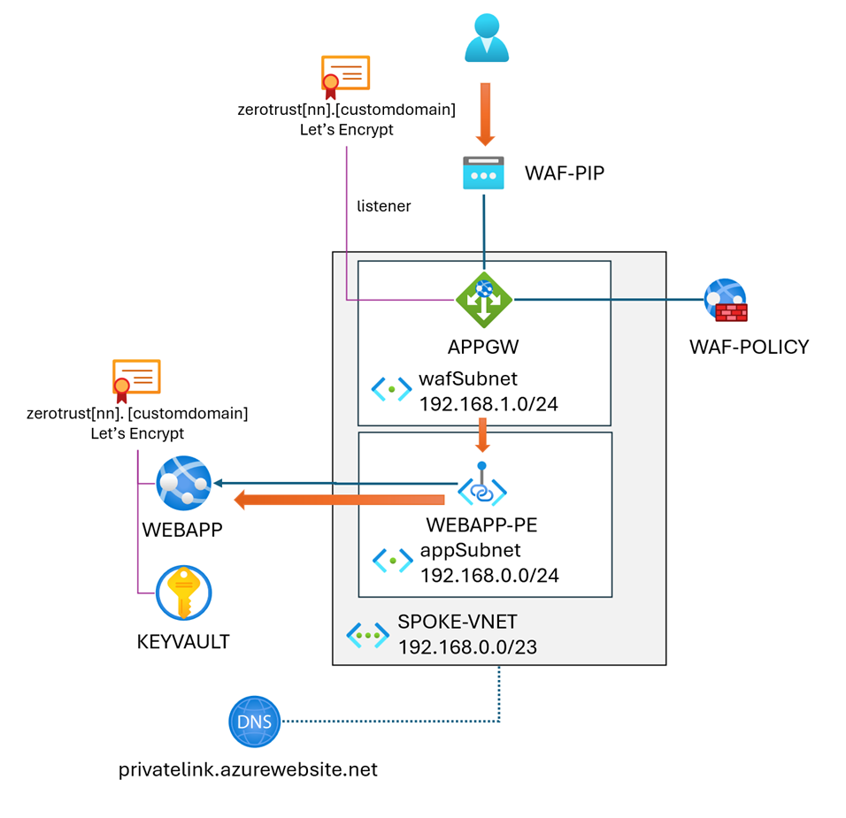
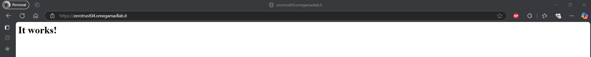
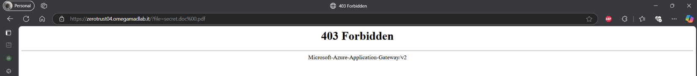
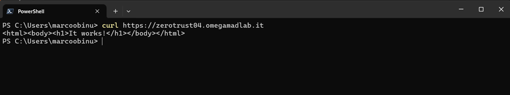
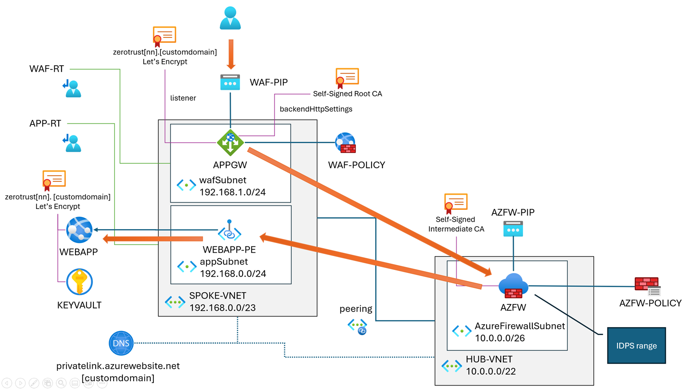

# Expose your web app with a Zero Trust approach

In this CoHack you're going to expose a web application hosted on App Service via a Zero Trust approach. In order to do so, who is going to reach the web app will go through:

- a Web Application Firewall implemented via an Application Gateway, to inspect for application layer attacks (cross-site scripting, SQL injection and so on);
- an Azure Firewall, to inspect for more generic attacks.

This is the hi-level design of what we're going to implement:

There are other options to implement Application Gateway and Azure Firewall in your environment, as listed [here](https://learn.microsoft.com/en-us/azure/architecture/example-scenario/gateway/firewall-application-gateway).

Additional details about the implementation choosen for this CoHack can be found at the following links:

- [Zero Trust with Azure Network Security](https://techcommunity.microsoft.com/blog/azurenetworksecurityblog/zero-trust-with-azure-network-security/3668280)
- [Zero-trust network for web applications with Azure Firewall and Application Gateway](https://learn.microsoft.com/en-us/azure/architecture/example-scenario/gateway/firewall-application-gateway)
- [Deploy a Zero Trust network for web applications](https://learn.microsoft.com/en-us/azure/networking/create-zero-trust-network-web-apps)

## Deployment guide

### Prerequisites

To execute this cohack scenario, you need:

- a custom domain
- a SSL certificate for `zerotrust[nn].[customdomain]`. You can get it from [Let's Encrypt](https://letsencrypt.org/) by using [Certify the web](https://certifytheweb.com/) on Windows or any other ACME client mentioned in Let's Encrypt documentation.
- an Azure DNS zone for the custom domain (optional)

Those are requirements since you can't use a self-signed certificate on App Service. You can eventually redesign the architecture with a web server on an Azure VM, and avoid using a certificate emitted by a well-known certification authority.

The Azure DNS zone is required to enable the custom domain on the web application. If you're using the same zone for all the participants, you can enable access for the hackers to the centralized DNS zone, or coaches can provide the values for the required TXT records to who is in charge to manage the zone.

----

## Challenges

This CoHack is divided in two challenges; the first one is quite simple, while the second requires more time and effort to implement it. These two challenges mimic the recommended approach to implement this architecture:

1. First, publish the web app via the Application Gateway and test the WAF functionalities;
2. Introduce the Azure Firewall and let the traffic flows within it before reaching the web app.

Since we're going to simulate a real-world scenario, the architecture will be deployed in a hub & spoke topology, with the firewall in the hub network and the WAF in the spoke one. You may place the WAF also in the hub but, since it's a resource that will be probably mananged by the developers who are able to trim the OWASP rules as per the application needs, it's more convenient to place it in the spoke, near the app.

Use the credential provided by the coach to gain access to the cohack environment.

### Challenge 01 - Publish the web application via the Application Gateway + WAF

In this first challenge, we're going to expose our web app on App Service via the Application Gateway. The web app is connected to our spoke vnet via a private endpoint.

The overall schema of **Challenge 01** is the following one:

Part of the resources are already deployed for you.

#### C01. Things to do

1. Configure the hostname zerotrust.[customdomain] on the web application. Use the appropriate certificate you can find in the Key Vault.
2. Create an application gateway APPGW and the related WAF-POLICY web application firewall policy. Specify the following settings:
   1. Place it in SPOKE-VNET\wafSubnet. If a network security group assigned to that subnet blocks some of the required ports, disassociate it.
   2. Use the provided WAF-PIP for the frontend configuration
   3. Set the FQDN `zerotrust[nn].[customdomain]` as the backend pool
   4. Create a routing rule:
      1. Create a basic listener for HTTPS 443. Use the _COHACK-ManagedIdentity_ to reference the _zerotrust-publicCA_ certificate in the Key Vault.
      2. In the _Backend targets_ section, specify the backend pool previously created as the backend target, and create a new backend setting for HTTPS 443 with a well-known CA certificate.
      3. Create a custom probe that test `https://zerotrust[nn].[customdomain]`. If the probe test fails, check if there's a network security group associated to _appSubnet_ and eventually remove it.
3. While the APPGW is under deployment, configure WAF-Policy to use the Microsoft Default Rule Set, which is based on OWASP 3.3 and enhanced by the Microsoft Threat Intelligence team (more info [here](https://learn.microsoft.com/en-us/azure/web-application-firewall/afds/waf-front-door-drs?tabs=drs21#drs-21)). Set the policy mode to **prevention**.
   Both the APPGW deployment and the WAF-Policy update can take about 5 minutes each.

#### C01. To prove you configured everything correctly

1. Test the configuration by invoking `https://zerotrust[nn].[customdomain]` from the your browser. You should be to reach the website:
   
2. Now execute a [path traversal attack](https://owasp.org/www-community/attacks/Path_Traversal) by invoking the url `https://zerotrust[nn].[customdomain]/?file=secret.doc%00.pdf`. You should be blocked by the WAF:
   
3. From a PowerShell prompt, use curl to invoke `https://zerotrust[nn].[customdomain]`. You should be able to reach the website and get the content of the home page:
    

### Challenge 02 - Go through the Azure Firewall and perform TLS inspection

In the second challenge, you're going to leverage the Azure Firewall in the HUB-VNET to perform TLS inspection of the traffic that goes from the APPGW to the web application.

This is the overall schema of the architecture we're going to implement:

Part of the resources are already deployed for you.

#### C02. Things to do

1. Add a route table to _wafSubnet_ to send all the traffic to _appSubnet_ through the firewall
2. Add a route table to _appSubnet_ to send all the traffic _wafSubnet_ through the firewall
3. Create an appropriate firewall rules to allow traffic from the application gateway to the web application. Once done, you should be able to reach the web app again from the browser.
4. Generate a self-signed intermediate certification authority certificate. You need to upload the root CA certificate on the backend HTTP settings of the Application Gateway, and the intermediate CA certificate on the firewall. You can leverage OpenSSL from the Azure Cloud Shell to do so. Upload the content of the `certificateScripts` folder to the cloud shell, and execute the `createCert.ps1`script to generate the certificates. Then use `uploadCert.ps1` to load them in the Key Vault. When prompted, download _rootCA.cer_ locally.
    > More information about the specs of the certificates needed for Azure Firewall, as well as the sample scripts provided in this CoHack, can be found in the [official documentation](https://learn.microsoft.com/en-us/azure/firewall/premium-certificates#create-your-own-self-signed-ca-certificate).
    Be aware that in a production environment you should avoid self-signed certs, and replace them with certificates provisioned by an [internal CA](https://learn.microsoft.com/en-us/azure/firewall/premium-deploy-certificates-enterprise-ca).
    Additional details about the TLS inspection process can be found [here](https://techcommunity.microsoft.com/blog/azurenetworksecurityblog/building-a-poc-for-tls-inspection-in-azure-firewall/3676723).
5. Modify the backend settings on APPGW, and specify you want to use a certificate which is not emitted by a well-known CA. Then, upload here the _rootCA.cer_ you previously donwloaded from the cloud shell.
6. On AZFW, turn on TLS inspection and upload the _interCA_ certificate available in the Key Vault. Then edit the application rule created before and enable the TLS inspection feature.
7. On the firewall, set IDPS to Alert and deny and exclude _wafSubnet_ from the private IP ranges.
   > This is required since Azure Firewall consider RFC1918 ip addresses as internal, and do not process internal traffic via the IDPS. To enable an internal IP address range, you can follow the [official documentation](https://learn.microsoft.com/en-us/azure/firewall/premium-features#idps-private-ip-ranges).

#### C02. To prove you configured everything correctly

1. Use curl to invoke `https://zerotrust[nn].[customdomain]`. You should be to reach the website and get the content of the home page:
    
2. Use curl to invoke `https://zerotrust[nn].[customdomain]`, this time specifying the _HaxerMen_ malicious user agent. You should be blocked by the firewall.
   

## Congratulations! You completed the CoHack 🎉
